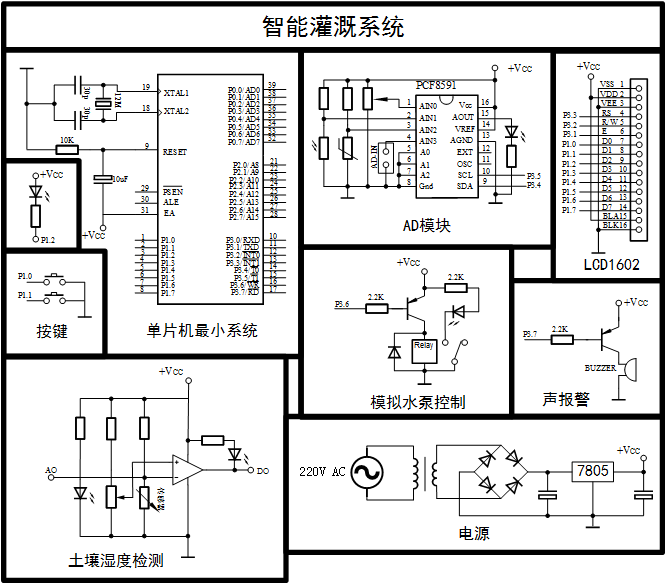
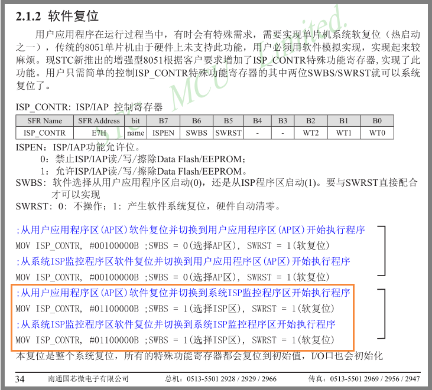

# 智能灌溉系统
##### 开发环境：
    Source program：*Keil uVision4 V9.02*
    Simulation：*Proteus 8 Professional V8.6 SP2*
    Schematic：*Microsoft Visio 2016 MSO*

## 文件链接

- 查看版本更新记录[版本历史](./Source-program/Documents/版本历史.md)
- 了解文件变量函数等的命名方式[命名方式](./Source-program/Documents/命名方式.md)
- 需要了解工程文件各自的功能定义，请参阅[工程说明](./Source-program/Documents/工程说明.md)
- 以及[开发随记](./Source-program/Documents/开发随记.md)

## 功能描述

#### 一、原理图：
  

#### 二、基本功能介绍：
**上电**：上电后，系统进行自检与初始化，并给出相应提示（详见下），随后打开定时器开关并提示初始化完成进入程序主循环；  
**时钟**：时钟功能及时钟调节：在定时器内设计时钟功能。  
**湿度数据**：湿度数据的检测（AD值）与转换（湿度值 *00%-99%*）； 
 
###### 自动工作模式：
- 按键：按键S1为模式切换键，按下抬起后切换自动/手动模式，S2无功能；
- 显示：除显示湿度与时间外，标注模式*Auto*（自动模式）；
- 蜂鸣器：自动模式下无需警报，蜂鸣器不工作；
- 继电器：湿度低于设定值时，自动开启，大于设定值关闭；

###### 手动工作模式：
- 按键：手动模式下按键支持组合操作（详见下）；
- 显示：除显示湿度与时间外，标注模式*Manual*（手动模式）；
- 蜂鸣器：湿度低于设定值且未开启继电器，警报响起，开启水泵或切换模式后关闭；
- 继电器：S2按下抬起后继电器状态改变；
                  
#### 三、特色功能：

###### 1.软件复位：
在REG51.H的基础上，定义STC89C5xRC系列特有的特殊功能寄存器**ISP_CONTR**，检测到下载信号芯片自动重启，避免了调试过程中需要不断冷启动的不便。    
   

###### 代码段：
    / ********************************  
    // 下载检测  
    / ******************************* /  
    sfr ISP_CONTR = 0xE7;  
    // ISP区复位：  
    void STC_ISP()  
    {  
        P30 = 1;  
        DelayUS(1);    // 等待电平稳定；  
        if (!P30)
            ISP_CONTR = 0x60;  
    }  
###### 2.系统自测、进度条：
在程序上电初始化前加入系统自检，便于及时发现电路异常；加入进度显示，便于追踪程序运行位置，减少调试难度。    
其中，PCF8591自检为调用模块的光敏电阻，判断检测到的光强提示当前是白天还是晚上。    
  
  
  
  

###### 部分代码段：                
    / ********************************  
    // 系统自检：  
    / ******************************** */  
    static void sysSelftest()  
    {
        u8 temp_ad;  
        // 初始化LCD1602：  
    	LCD1602_Init();   
    	// 设置PCF8591检测亮度：  
        PCF8591_Con_Init(CON0);  
        Read_PCF8591();                 //第一组值丢弃；  
    #ifndef DeveloperMode               //调试模式下不再执行，耗时较长；  
    //    TestCode();  
        // 检测1602显示：  
        Dis_SysSelftest();  
        Dis_ProgressBar(2);  
        // 系统状态提示灯常亮0.6S：  
        SysLED_On();  
        DelayMS(600);  
        SysLED_Off();  
        Dis_ProgressBar(4);  
        // 继电器打开0.6S：  
        Relay_On();  
        DelayMS(600);  
        Relay_Off();  
        Dis_ProgressBar(4);  
        // 蜂鸣器打开0.6S：  
        Buzzer_On();  
        DelayMS(600);  
       Buzzer_Off();  
        Dis_ProgressBar(4);  
    #endif  
        // 检测光线强度：  
        temp_ad = Read_PCF8591();   
        if (temp_ad > LIGHT_INTENSITY_THRESHOLD)  
        {
            Dis_Its_Daytime_Not_Night(temp_ad, FALSE);  
    //        TestCode();  
        }  
        else  
        {  
            Dis_Its_Daytime_Not_Night(temp_ad, TRUE);  
        }  
    }  

###### 3.开发者模式：
可以注意到，上方代码段中有如下几行代码：    
>#ifndef DeveloperMode    //调试模式下不在执行，耗时较长；    
>// TestCode();    
>......    
>#endif  

其中***TestCode()***所包含的代码段为测试代码，可方便在实物Debug的过程中测试做程序断点，观察此段代码是否被执行；而调试结束后，只需将***DeveloperMode***的定义屏蔽，即使忘记删除测试代码，也不会影响代码的正常执行；

###### TestCode()代码段：
    / ********************************  
    // 测试代码  
    / ******************************** */  
    void TestCode()  
    {  
    #ifdef DeveloperMode  
        SysLED_On();  
        DelayMS(500);  
        SysLED_Off();  
    #endif  
    	_nop_();  
    }  

###### ~~4.TIME_BASE：~~
~~ 时基应用不明显，不再说明；~~   

###### 5.组合按键检测：
（组合按键不影响普通按键检测，选用）  
过多的按键会使操作较为复杂，为某些不常用的功能单独设计一个按键意义不大，因此在程序中引入了部分简单的按键组合操作来实现这些不常用的功能；  
在**手动**模式下：  
- 单独按下S1后抬起，模式切换；S2：打开/关闭继电器；
- 按下S1保持，此时按下后放开S2，进入时钟秒调节，此时松开S1，S1、S2单击操作的功能均为秒归零；
    - 若未松开S1继续或再次按下S1保持，此时按下后放开S2进入分钟调节，S1、S2单击操作的功能分别为加/减；
    - 小时的调节同分钟；到达小时调节后再进行一次组合键操作回到手动模式显示；
- 按下S2保持，此时按下后放开S1，进入湿度阈值调节，此时松开S2，S1、S2单击操作的功能分别为加/减；
    - 湿度阈值再程序中设定的有上下限，减至下限或加至上限不能再进行加减操作；
    - 再进行一次组合键操作回到手动模式显示；    
由于代码过多此处只引用一小段，具体按键代码在文件[Key_WorkMode_DisControl.C][按键文件位置]中查看，显示内容实现在文件[SeparateDis.C][显示文件位置]中查看；

###### 部分代码段：
    / ********************************  
    // 按键响应  
    / ******************************** */  
    void KeyResponse()  
    {  
        checkPressKey();    //按键按下检测;  
        checkCombKey();     //按键组合检测，在checkPressKey()后调用；  
        checkOrdinaryKey(); //普通按键检测，在checkCombKey()后调用；  
        keyCheckOver();     //按键检测完毕响应，在checkOrdinaryKey()后调用；  
    }  

#### 四、后续功能设想：

###### 0.彩蛋：
不定时更新；

###### ~~1.时钟掉电记忆：~~
可采用89C52自带的E2prom功能；  
目前状态：弃；  

###### ~~2.时间-湿度写入E2prom：~~
即湿度记录功能，可采用89C52自带的E2prom功能；    
目前状态：弃；

###### ~~3.警报关闭：~~
在手动模式下，湿度不足的警报提醒可采用按键关闭；  
目前状态：已采用手动模式下“湿度不足时打开继电器”即可关闭蜂鸣器警报；

###### ~~4.LCD1602显示：~~
LCD1602个性化显示，如行左移等；   
目前状态：弃；  

###### 5.AD湿度转换：
AD值向湿度转化需要结合实物进行处理，目前设想方案：   
1. 找到一个AD值设定为湿度99，另一个设定为湿度0，在之间采用y=kx+b线性计算(目前程序预置的方案)；    
1. 找多个线性区间构建多个线性方程；
1. 特殊曲线方程；
1. 测试多组 “AD-湿度” ，利用二维数组进行预置；    

[显示文件位置]:(https://github.com/alan-git/IrrigationSystems/blob/master/Source-program/DeveloperCode/KeySeparateDis.C)
[按键文件位置]:(https://github.com/alan-git/IrrigationSystems/blob/master/Source-program/Code/DeveloperCode/Key_WorkMode_DisControl.C)

